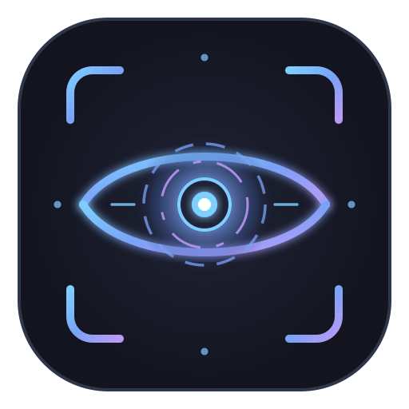

<p align="center">
  
</p>

<h1 align="center">VisageSoul</h1>

<p align="center">
  <strong>Fast, secure Windows Hello alternative for Linux with facial and gesture-based biometric authentication.</strong><br>
  <em>Unlock your desktop, authenticate sudo, and log in with your webcam in 0.3s.</em>
</p>

<p align="center">
  
  
  
  
  
</p>

---

**VisageSoul** is a modern, high-performance **Windows Hello alternative for Linux** that integrates seamlessly with Linux PAM (Pluggable Authentication Modules). It provides ultra-fast biometric face unlock (~0.3s) for your desktop lock screen, Display Managers (SDDM, GDM, LightDM), Polkit authorization windows, and terminal `sudo` commands using standard RGB webcams or IR cameras.

Powered by state-of-the-art neural vision models (**YuNet** for microsecond face detection and **SFace** for 128D cosine embeddings), paired with **MediaPipe 3D** for selectable 2FA gesture confirmation (👍 Thumbs Up, 🖐️ Open Palm, or 🔄 Both), **Multi-Layer Face Anti-Spoofing (FAS)**, and **CLAHE** low-light compensation.

---

## 🛡️ Multi-Layered Anti-Spoofing & Security Architecture

VisageSoul incorporates a multi-tiered defense-in-depth security pipeline to defeat presentation attacks (photos, digital screens, replays, and handheld phones):

1. **Deep Neural Anti-Spoofing (MiniFASNet V2)**:
   - Deep convolutional feature analysis trained to distinguish real human skin textures from paper print grain, photo paper reflections, and OLED/IPS digital screen emission.
   - Evaluates real face probability vs. print and screen attack likelihood on every frame.

2. **3D Facial Geometry & Projective Parallax Analysis**:
   - Computes non-linear aspect ratios across the eye-to-nose-to-mouth triangular plane (`req >= 0.020`).
   - Real 3D convex faces exhibit continuous out-of-plane parallax during natural postural sway, whereas flat 2D photographs (mounted on tripods or held in hand) behave as rigid affine planes with zero depth perspective.

3. **Canonical Aligned Eye Dynamics & Micro-Saccades**:
   - Performs canonical affine face rectification and measures high-frequency Sobel variance across the eye band (`std >= 0.003, mad >= 0.001`).
   - Rejects frozen eyelids, static photo eyes, and printed portraits lacking natural micro-saccadic eye movement.

4. **2D Fast Fourier Transform (FFT) Moiré & Glass Specular Reflection**:
   - Evaluates the 2D frequency spectrum of the face crop to detect the artificial periodic sub-pixel grid (Moiré pattern) emitted by digital screens.
   - Detects harsh specular glare and glass reflections typical of smartphone and tablet screens.

5. **Biomechanical Decoupling (Independent Face & Hand Micro-Tremor)**:
   - Tracks the normalized Euclidean distance vector `D(t) = ||P_wrist(t) - P_face(t)|| / face_size` between the facial center and the hand wrist.
   - **Handheld photo attacks**: The printed face and printed hand are fixed on the exact same piece of glass; shaking the phone moves both in identical synchrony (`std_dist < 0.010`).
   - **Real living humans**: The arm neuromuscular tremor (8–12 Hz) is physically independent of neck/head postural sway (`std_dist >= 0.020, mad_dist >= 0.012`), verifying independent biomechanical life.

6. **Instant Attack Spike Lockout & Session Taint**:
   - If an attack pattern or screen spike is detected in any frame (`p >= 60%`), the session is marked as permanently tainted (`session_tainted = True`). The attempt is immediately aborted and forces standard password entry.

---

## 🖐️ Gestures vs. Passive Face-Only Authentication

### Recommended Default: 2FA Gesture Confirmation (Active by Default)
By default, VisageSoul is configured with **Gesture 2FA enabled** (`require_gesture = true` with `gesture_type = both`: 👍 Thumb Up or 🖐️ Open Palm). This provides true multi-factor biometric authentication:
- **Factor 1:** Face identity (128D cosine embedding) + 3D facial liveness.
- **Factor 2:** Physical, intentional hand gesture confirmation with independent biomechanical motion.

### Passive Mode: Face-Only Authentication
If gesture validation is disabled (`require_gesture = false`):
- VisageSoul operates in **passive face-only mode**, unlocking in ~0.3s simply by looking at the camera.
- It continues to execute all 4 passive facial anti-spoofing layers: MiniFASNet V2 Neural FAS, 3D Facial Geometry Parallax, Eye Dynamics, and Screen Moiré analysis.

> [!WARNING]
> **Security Notice regarding Passive Mode:**  
> Disabling gesture confirmation reduces the defense-in-depth protection against advanced physical presentation attacks (such as high-resolution full-size photos or video screens moved skillfully in front of the camera). Gesture 2FA confirmation is strongly recommended for high-security environments.

---

## ⚠️ Biometric Security Risks & Technical Limitations

While VisageSoul provides state-of-the-art multi-factor biometric authentication on Linux, users should be aware of intrinsic biometric considerations:

1. **Close Lookalikes & Identical Twins**: As with all 2D/RGB facial recognition systems, identical twins or close biological relatives with near-identical facial structures may produce elevated similarity scores.
2. **High-Precision 3D Physical Replicas**: Complex, customized 3D medical-grade silicone masks with realistic convex facial features and eye openings can present challenges to standard RGB cameras lacking dedicated structured-light IR depth sensors.
3. **Extreme Low-Light Conditions**: In pitch-black rooms, standard RGB webcams may struggle with contrast. VisageSoul incorporates CLAHE adaptive luminance boost, but sufficient ambient light (or screen brightness) is required for optical feature extraction.
4. **Camera Resolution & Dirt**: Webcams with resolutions lower than 720p or dirty lenses can degrade frequency-based Moiré detection.
5. **Fail-Safe Rate Limiting**: If biometric verification fails or times out after a configurable limit (default: 3 attempts within 300s), VisageSoul temporarily locks out camera authentication and forces standard Unix password authentication to prevent brute-force attacks.

---

## ⚙️ Customizability via Graphical Interface (GUI) & Config

All verification rules, thresholds, and timeouts are fully customizable without modifying code:

- **Similarity Threshold (`0.50` – `0.95`)**: Adjust matching strictness (default: `0.70`).
- **Verification Timeout (`1.0s` – `15.0s`)**: Adjust camera scan window (default: `4.5s`).
- **Consecutive Consensus Window**: Multi-frame temporal consensus (8 consecutive matched frames required for authorization).
- **Max Failed Attempts (`1` – `10`)**: Rate-limiting lockout threshold (default: `3`).
- **Gesture Selection**: Choose between 👍 Pulgar Arriba, 🖐️ Mano Abierta, or 🔄 Ambos (Cualquiera).
- **Audio Feedback**: Pleasant system chime on successful login with customizable volume.
- **Low-Light Boost**: Automatic CLAHE contrast enhancement.

You can adjust these settings visually in **`visagesoul gui`** or directly in `/etc/visagesoul/config.ini`:

```ini
[security]
threshold = 0.70
timeout = 4.5
min_face_size = 60
liveness_check = true
require_gesture = true
gesture_type = both
auto_unlock = true
sound_feedback = true
sound_volume = 35
max_attempts = 3
attempts_window = 300
```

---

## Installation

Clone the repository and run the installer:

```bash
git clone https://github.com/Aetzax/visagesoul.git
cd visagesoul
sudo ./VisageSinstall.sh
```

The installer will:
1. Compile the native C PAM module (`pam_visagesoul.so`) into `/usr/lib/security/`.
2. Download and verify the neural models (YuNet, SFace, MiniFASNet V2, MediaPipe Gesture).
3. Set up the Python virtual environment and system binaries in `/opt/visagesoul/`.
4. Configure desktop launchers and icons for KDE Plasma and desktop environments.

---

## Quick Start

### 1. Register your face

Run the interactive enrollment wizard:

```bash
# Register base profile
visagesoul enroll

# Register an additional aspect (e.g. wearing glasses)
visagesoul enroll --label "Glasses"
```

Or use the graphical control panel:

```bash
visagesoul gui
```

### 2. Enable PAM Authentication

Enable VisageSoul for your desired services:

```bash
# Enable for KDE lock screen and SDDM
sudo visagesoul enable kde
sudo visagesoul enable sddm

# Enable for terminal sudo
sudo visagesoul enable sudo

# Enable for GUI authorization prompts
sudo visagesoul enable polkit-1
```

### 3. Test Recognition

Test your camera feed, face matching score, 3D liveness, and gesture tracking in real time:

```bash
visagesoul test
```

---

## CLI Reference

| Command | Description |
| :--- | :--- |
| `visagesoul enroll [user] [--label "..."]` | Enroll a new face profile or aspect. |
| `visagesoul test [user]` | Run real-time camera, liveness, and gesture diagnostics. |
| `visagesoul status` | Display system status, camera, and active PAM rules. |
| `visagesoul list` | List all enrolled users and their registered aspects. |
| `visagesoul remove <user>` | Delete a user's face profile. |
| `visagesoul enable <service>` | Enable PAM authentication for a service (`sddm`, `kde`, `sudo`, `polkit-1`, or `all`). |
| `visagesoul disable <service>` | Disable PAM authentication for a service. |
| `visagesoul doctor` | Run hardware, library, and permissions diagnostics. |
| `visagesoul gui` | Open the Qt6 graphical control panel. |

---

## Architecture & Security

- **Process Isolation**: The PAM module (`src/pam_visagesoul.c`) forks verification into a separate process with strict return code handling (`PAM_SUCCESS`, `PAM_AUTHINFO_UNAVAIL`, `PAM_IGNORE`).
- **Administrative Recursion Bypass**: Internal configuration commands (`visagesoul enable`, `visagesoul disable`, `visagesoul remove`, and the GUI) inspect the caller process tree (`/proc/$PPID/cmdline`). Administrative tasks bypass the camera (`PAM_IGNORE`) and require standard password verification.
- **Fail-Safe Password Fallback**: When recognition times out or biometric matching fails, the module immediately returns `PAM_AUTHINFO_UNAVAIL`, allowing Linux PAM to fall back cleanly to password entry without authentication deadlocks.
- **Input Sanitization**: Usernames are validated against path traversal and shell injection patterns before any filesystem operations.
- **Biometric Templates**: Facial embeddings are stored as 128-float cosine vectors. Raw images are discarded immediately after feature extraction.
- **Runtime State**: Attempt counters and rate-limiting data are stored in isolated runtime directories to prevent symlink attacks.

---

## Uninstallation

To cleanly remove VisageSoul and restore default PAM configurations:

```bash
sudo ./VisageSuninstall.sh
```

---

## Support & Donations

If you find VisageSoul useful and want to support ongoing development:

- **PayPal:** [paypal.me/aetzax1](https://paypal.me/aetzax1)

---

## License

This project is licensed under the [GNU General Public License v3.0](LICENSE).
